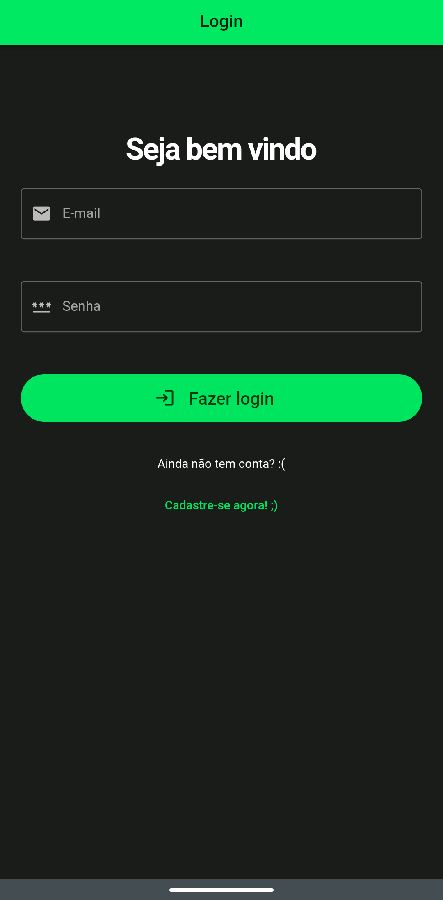
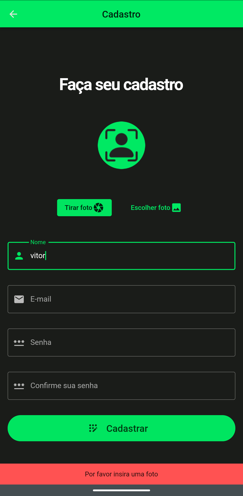
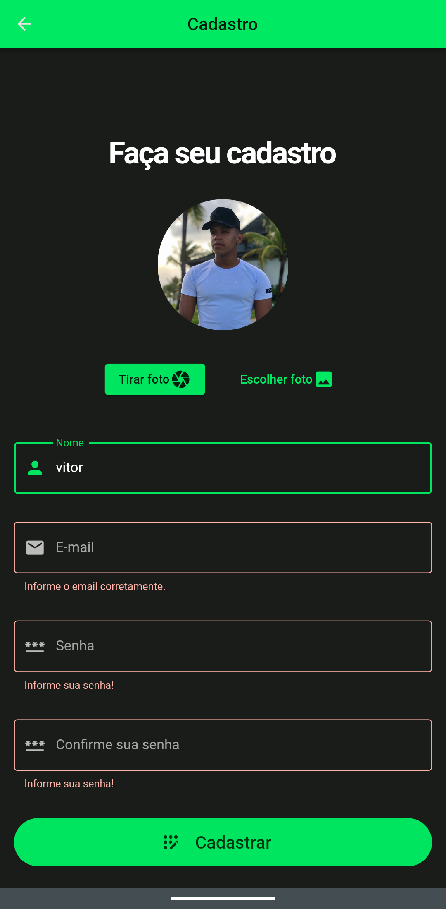
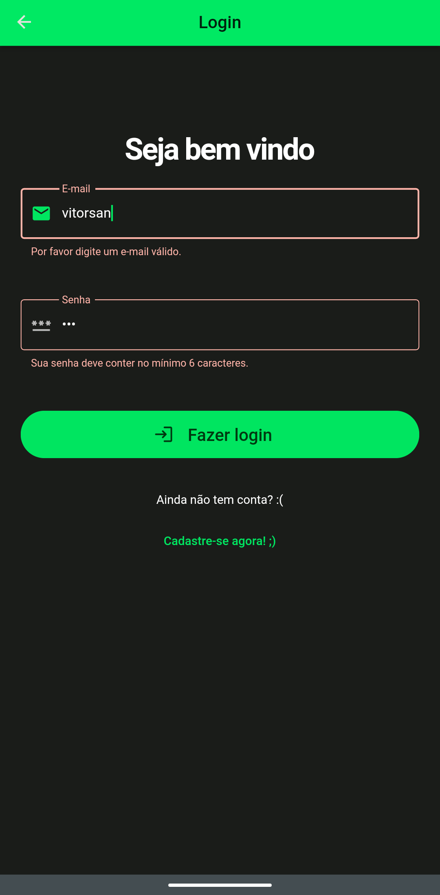
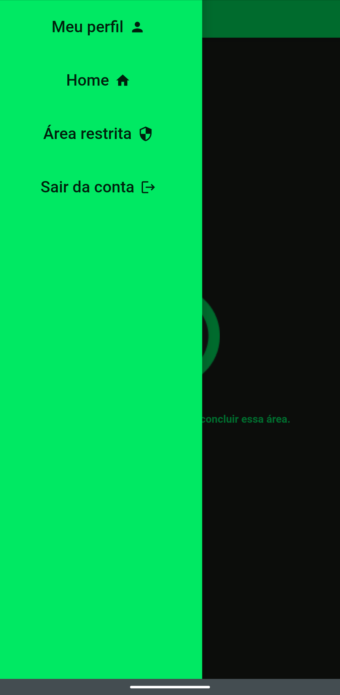

# Desafio flutter - Capyba software


<p>App simples desenvolvido em flutter.</p>

<p>
  
  
  
</p>

<div widht="20"  height="20" align="right" >
  
</div>

## Tópicos

[Sobre a aplicação](#teste-capyba-software)

[Tecnologias e Ferramentas](#tecnologias-e-ferramentas)

[Instalação e uso](#instalação-e-uso)


<br>

## 📝 App desenvolvido utilizando flutter.
<br>
<br>

A aplição possuí um sistema simples de atenticação de usuário, utilizando firebase, onde o usuário pode se cadastrar e fazer login!
<br>
<br>
<p align="center">
  
</p>
<p align="center">
  
</p>
<br>
<br>

📌 O usuário pode visualizar um preview da foto selecionada/capturada por ele no momento do cadastro.
<br>
<br>
<p align="center">
  
</p>
<br>
<br>
📌 O usuário não pode realizar seu cadastro sem preencher todos os campos do formulário, inclusive a foto é obrigatória.
<p align="center">
  
</p>
<br>
<br>
📌 Erros também são mostrados nos inputs, caso o usuário, não preencha e-mails ou senhas válidas.
<p align="center">
  
</p>
<br>
<br>
📌 A mesma coisa ocorre no momento do login do usuário, caso ele insira uma senha incorreta, e-mails inválidos ou não esteja cadastrado erros serão exibidos pra ele.
<p align="center">
  
</p>
<br>
<br>
📌 Ao logar no app o usuário tera acesso a um menu lateral onde há opcções de navegação pelo app e fazer logout, caso queira.

<p align="center">
  
</p>
<br>
<br>

<br>

## Tecnologias e Ferramentas

As seguintes tecnologias foram utilizadas no desenvolvimento do projeto:

- [Flutter](https://devdocs.io/html/)
- [Dart](https://devdocs.io/css/)

<br>

## Instalação e Uso

Para rodar a aplicação, você precisa instalar o [Node](https://nodejs.org/en/)

Siga os passos abaixo:

```bash
# Abra um terminal e copie este repositório com o comando
$ git clone https://github.com/vitorSantanaDev/teste-capyba-software.git
# ou use a opção de download.

# Entre na pasta com
$ cd teste-capyba-software

# Instale as dependências abrindo o arquivo 'pubspec.yaml'
$ CTRL + S

# Rode a aplicação
$ Instale a extensão do flutter no seu VSCode, nela você poderá executar o app, em um emulador web no próprio google Chrome, ou se preferir rode algum emulador android.
```

<br>

---

Feito com 💚 by [Vitor_Santana](https://github.com/vitorSantanaDev)

[](https://www.linkedin.com/in/vitor-santana-bbb607217/)
[](mailto:vitorsantana.developer@gmail)
